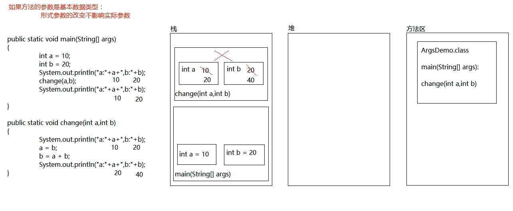

### Java基础知识

1.Java接受系统输入

注意package信息要放在import信息之前；
一般使用java.util.Scanner接受数据，注意java接受数据也是要指明类型的；

2.关于数组的内存分配

3.数组静态初始化时存在简化形式；
如int[] a = new int[]{1,2,3};
可以简化成 int[] a = {1,2,3};

4.方法重载的定义

类中可以出现重名方法，只要参数列表不同，与返回值无关。

参数列表不同包括两种情况：**参数数量不同或者参数数据类型不同**；

如果参数个数和数据类型都相同，将不会被视为重载，报错。

5.Java中参数传递是按值传递，方法内对形式参数的改动不会影响原来的实际参数，但是如果传递的参数是引用类型，在方法内对于形式参数的改动将会影响原来的实际参数。

6.成员变量和局部变量存在几点不同

首先，在类中位置不同，成员变量在方法外，局部变量在方法中或者声明上；

其次他们在内存中的位置不同，成员变量存在于堆内存中，局部变量只能存在于栈内存中；

因此他们的存活生命周期不同，成员变量依附于对象，随着对象的的消失而消失，而局部变量随着方法的调用而存在，随着方法调用结束而消失；

最后他们的初始化值不同，成员变量有默认初始化值，而局部变量必须手动初始化。 

7.关于Java的构造方法有几点需要说明：

方法名必要要和类名一致；

签名中没有返回值类型，void也不可以写；

没有具体的返回值；

构造方法执行的是对对象的初始化操作；

系统会默认提供一个无参构造方法，但是只要自己构建了构造方法，系统就不会再提供，最好自己重载无参构造方法；

8.当类名成为形参或者返回值时，其实是传递或者返回的是实例对象。

